Se debe ejecutar este comando siempre para borrar la **huella** del ssh ya que la IP es la misma en las maquinas vulnerables.
ssh-keygen -R 172.17.0.2

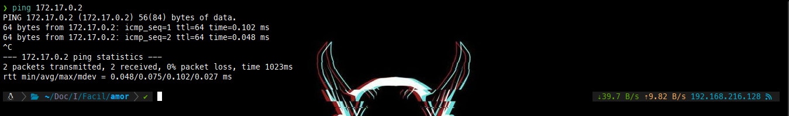
sudo nmap -p- -sS -sC -sV --min-rate=5000 -n -vvv -Pn 172.17.0.2 -oN puertos

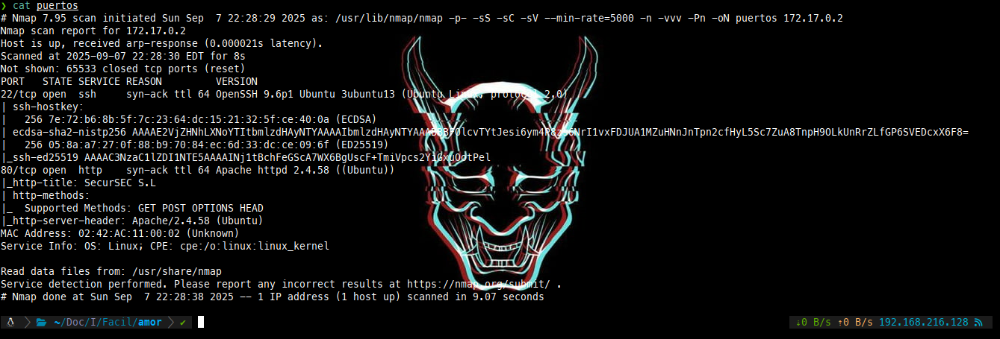

Carlota
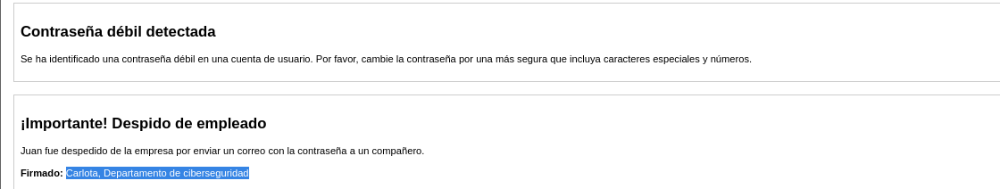

Intentamos un Brute Force Attack
hydra -l carlota -P /usr/share/wordlists/rockyou.txt ssh://172.17.0.2 -I -t 64
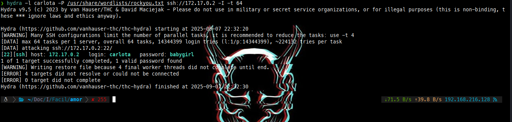

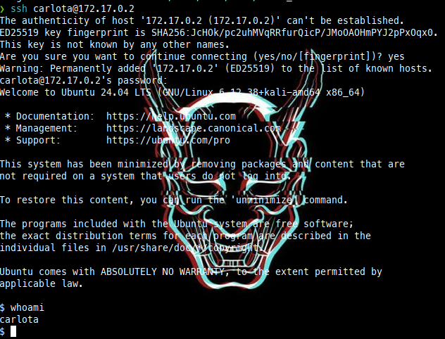
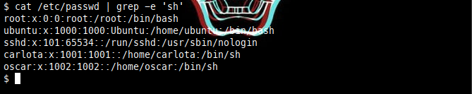
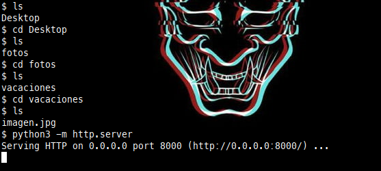
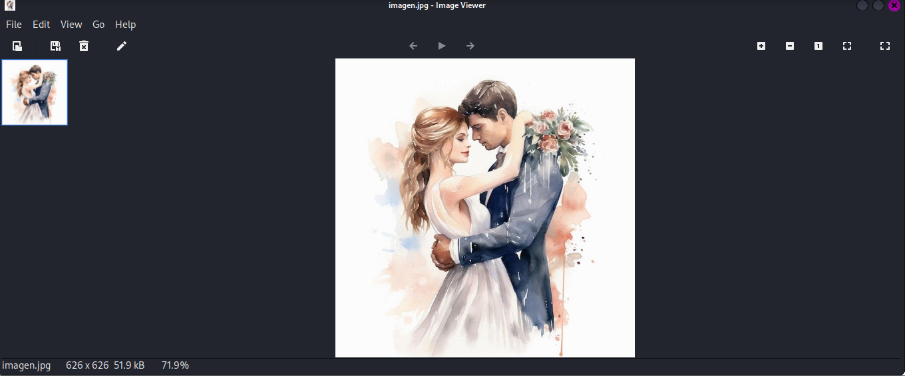
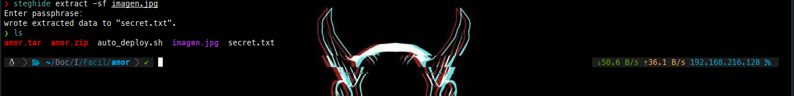
echo "ZXNsYWNhc2FkZXBpbnlwb24=" | base64 -d; echo
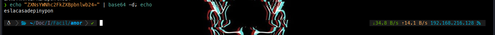

cambiamos al usuario oscar con la contraseña obtenida
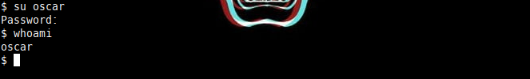
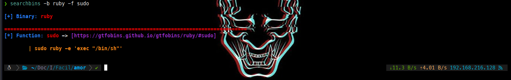
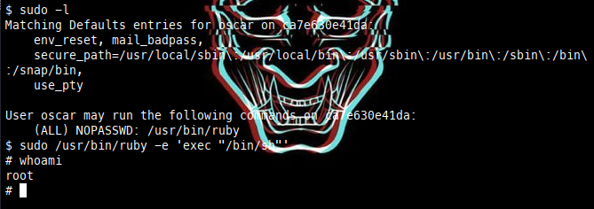