## Levantamos la maquina
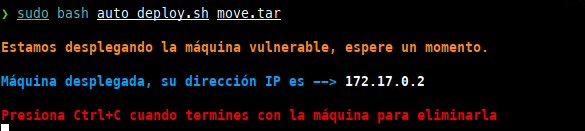

## Conectividad

Tenemos conectividad con la maquina, además sabemos que es una maquina linux por el **TTL** 64
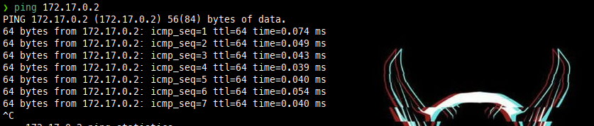

## Escaneo de Puertos
Hacemos un escaneo de puertos con **nmap**
sudo nmap -p- -sS -sC -sV --min-rate=5000 -n -vvv -Pn 172.17.0.2 -oN puertos

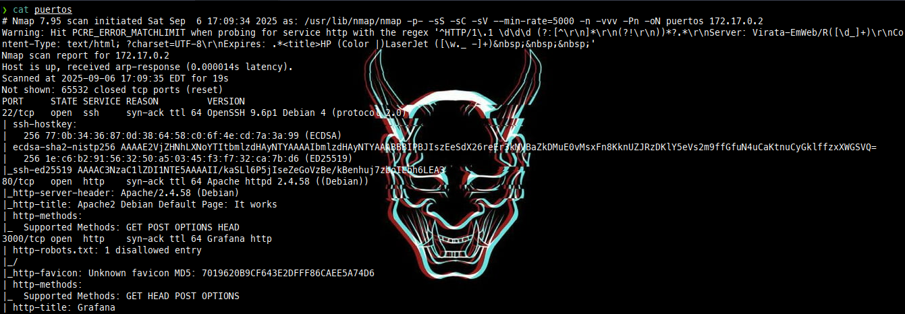

Hay 3 puertos abiertos
21 -> **FTP**
22 -> **SSH**
80 -> **HTTP**
3000 -> **GRAFANA**
## Fuzzing
si hacemos Fuzzing con **gobuster** vemos que hay un archivo llamado **maintenance.html.** 
instalamos Seclists
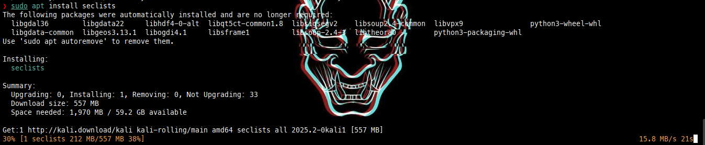

sudo gobuster dir -w /usr/share/wordlists/seclists/Discovery/Web-Content/directory-list-2.3-medium.txt -x .php,.html,.sh,.py -u "http://172.17.0.2/"   
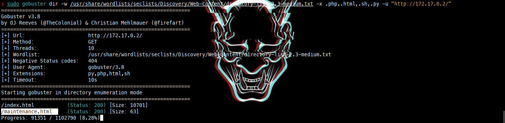

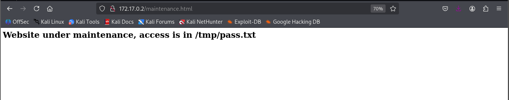
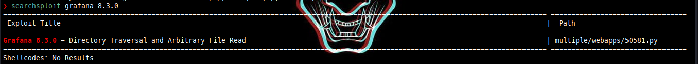
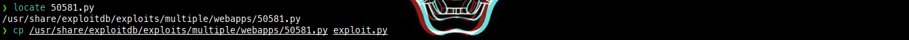
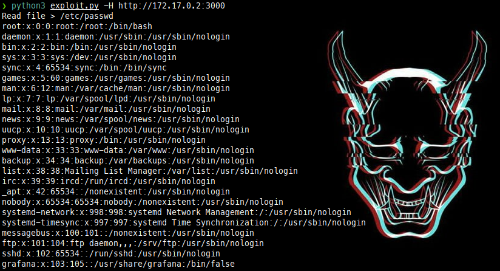
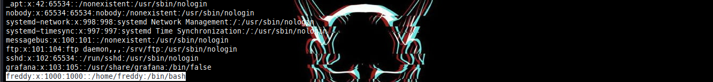
Vemos que hay un Usuario llamado Fredy 

Vemos que grafana tiene la version **8.3.0**
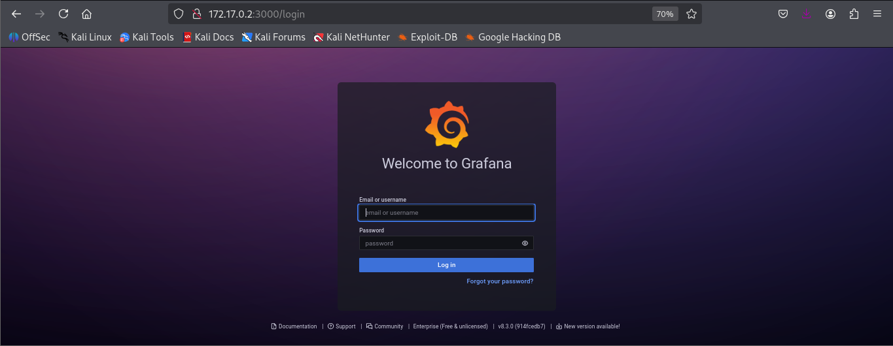
Revisamos si hay alguna vulnerabilidad para esta version 

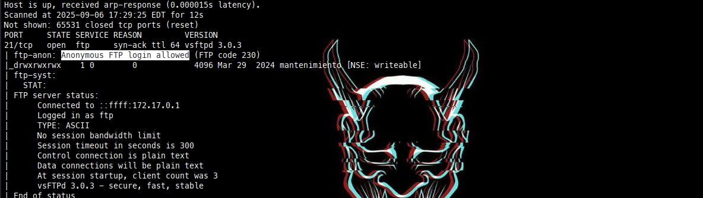
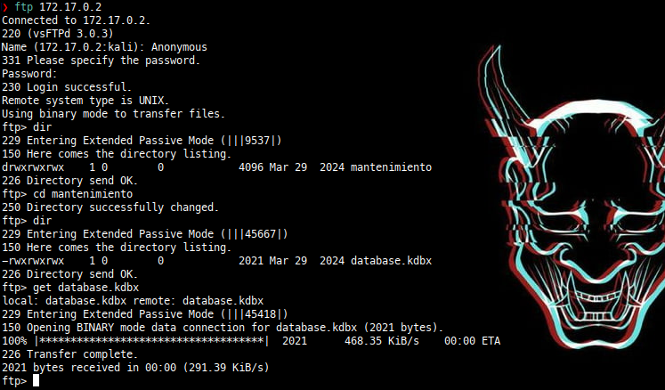
Si buscamos en internet vemos que el archivo database.kdbx se puede desencriptar con Keepassxc.

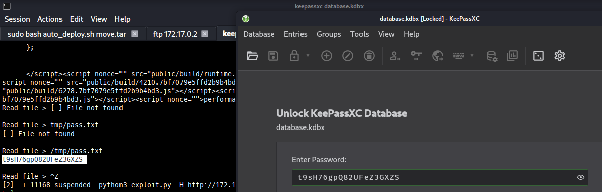

Y vemos la clave de freddy. Por lo que podemos probar por SSH ya que si recordamos, el puerto estaba abierto.

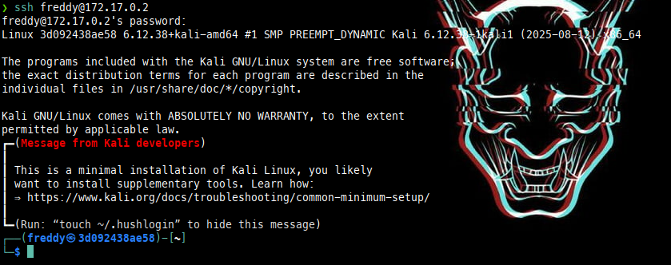
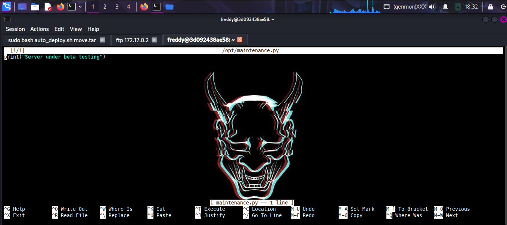

cd /opt
sudo git clone https://github.com/r1vs3c/searchbins.git
cd searchbins

sudo apt install jq yq -y

sudo bash install.sh

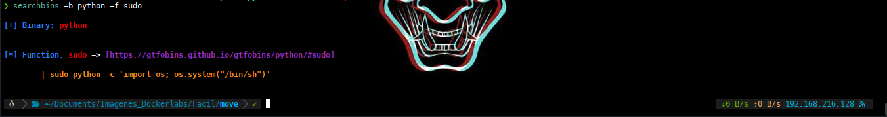
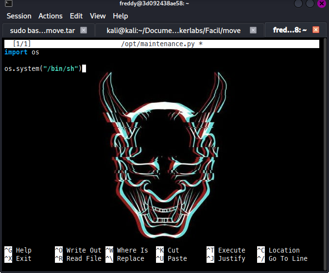
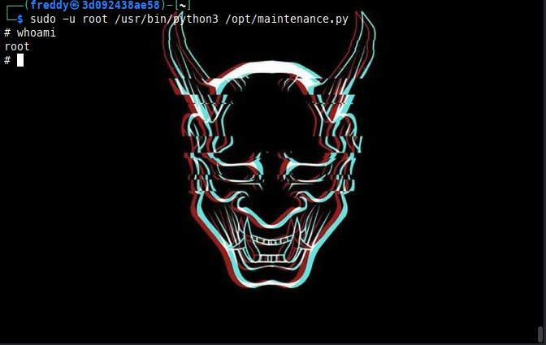
Somos Root